# Projetos-Mobile-Usando-Flutter
Projetos propostos pela disciplina de Laboratório de Programação de Dispositivos Móveis, cursada em 2022.2 na Universidade Federal Fluminense (UFF).

## Jogo de Adivinhação

Um aplicativo interativo em que o jogador deve adivinhar um número secreto escolhido aleatoriamente pelo sistema. O jogo fornece dicas conforme os palpites inseridos, indicando se o número é maior ou menor que o chute. O jogador pode escolher entre três níveis de dificuldade:

- **Fácil**: 20 tentativas
- **Normal**: 15 tentativas
- **Difícil**: 6 tentativas

A pontuação inicial é 1000 pontos, sendo reduzida em função da diferença entre o chute e o número secreto.

**Principais funcionalidades:**
- Cálculo de pontuação dinâmica
- Exibição de feedback para cada tentativa

**Imagens do App**

  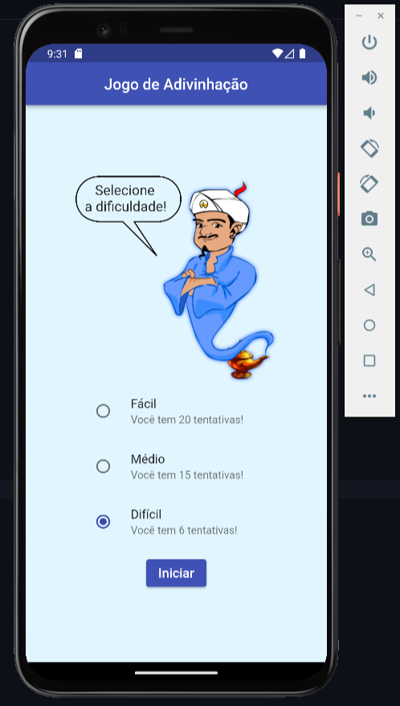
  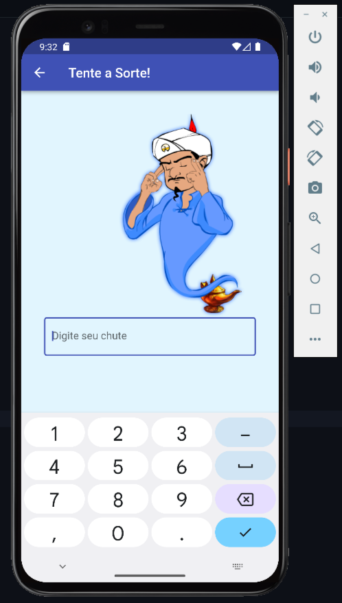
  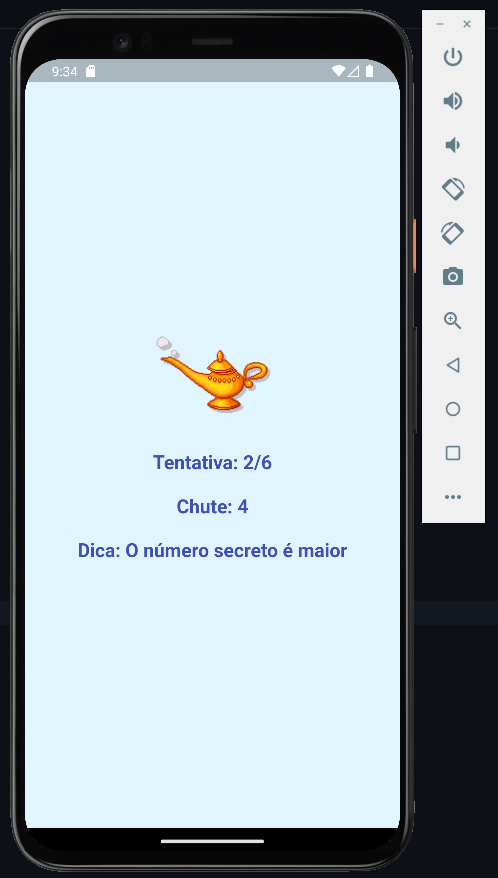

## COVID-19 Tracker

Um aplicativo que rastreia informações sobre a COVID-19 em tempo real, utilizando a API [Covid 19 Brazil](https://covid19-brazil-api-docs.vercel.app/). Os usuários podem visualizar dados globais, nacionais ou consultar informações de um país específico.

**Principais funcionalidades:**
- Consulta de dados da COVID-19 via API
- Filtros de pesquisa:
  - **Brasil** (dados gerais, por estado e por data)
  - **Todos os países** (dados globais)
  - **Consulta por país** (seleção individual)
- Exibição de estatísticas: casos confirmados, mortes, suspeitos, recuperados, entre outros.

**Imagens do App**

  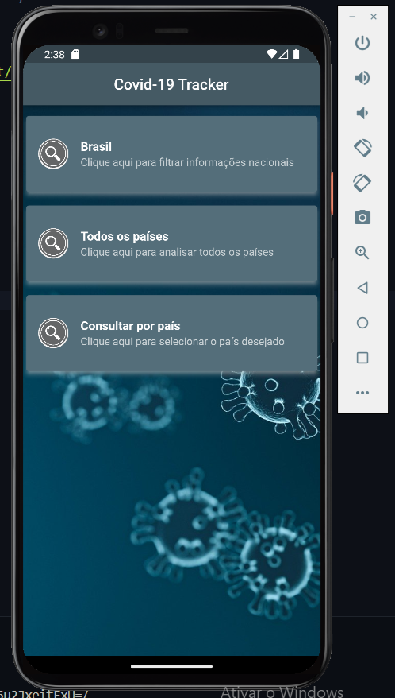
  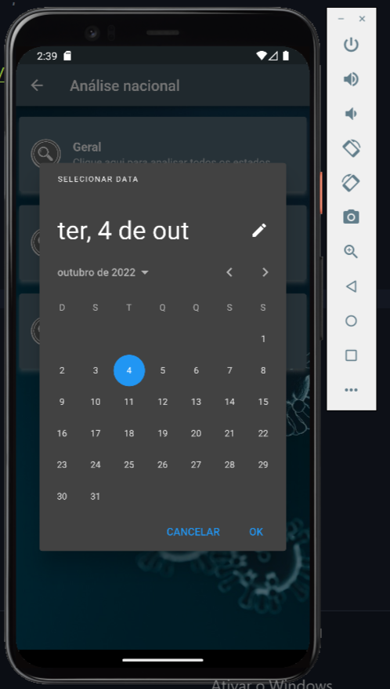
  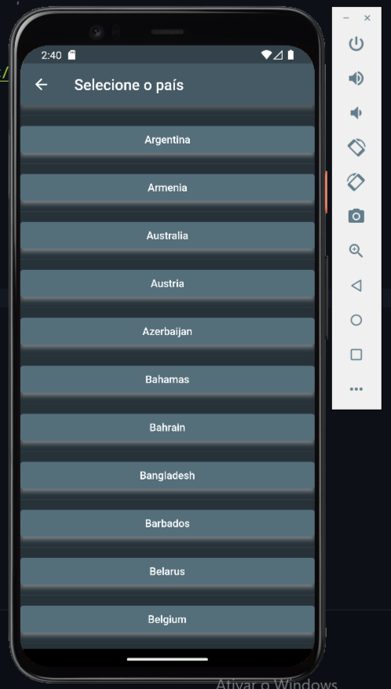

  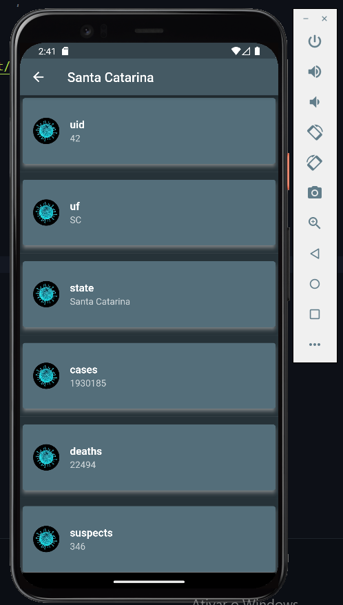
  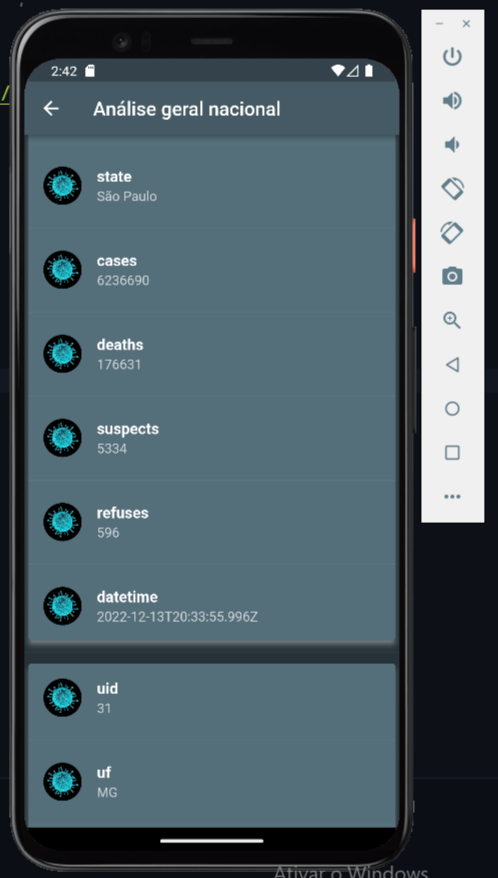

## Lista de Tarefas com SQLite

Um aplicativo de gerenciamento de tarefas com operações CRUD (Create, Read, Update, Delete) armazenadas localmente no banco de dados SQLite.

**Principais funcionalidades:**
- Persistência de dados local com SQLite
- Adição, edição e remoção de tarefas
- Exibição de tarefas armazenadas no banco local

**Imagens do App**

  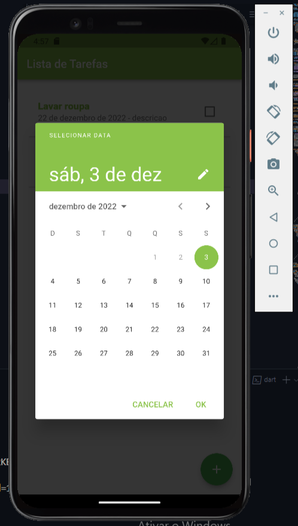
  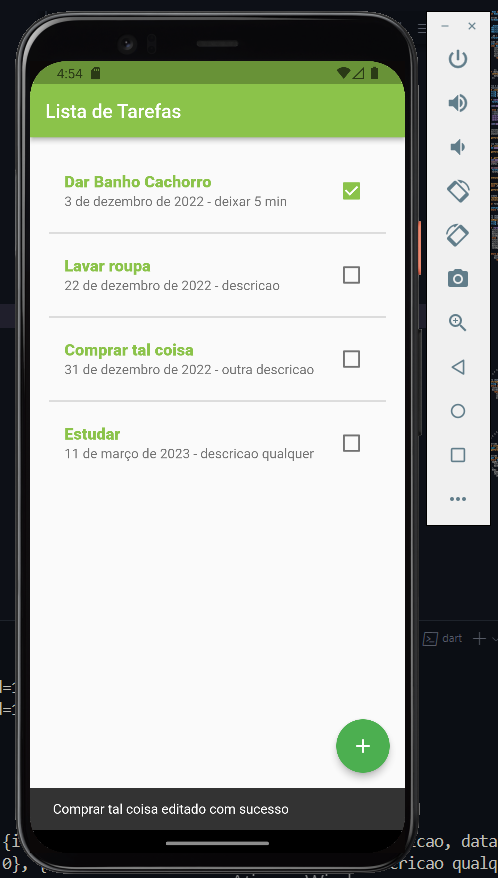
  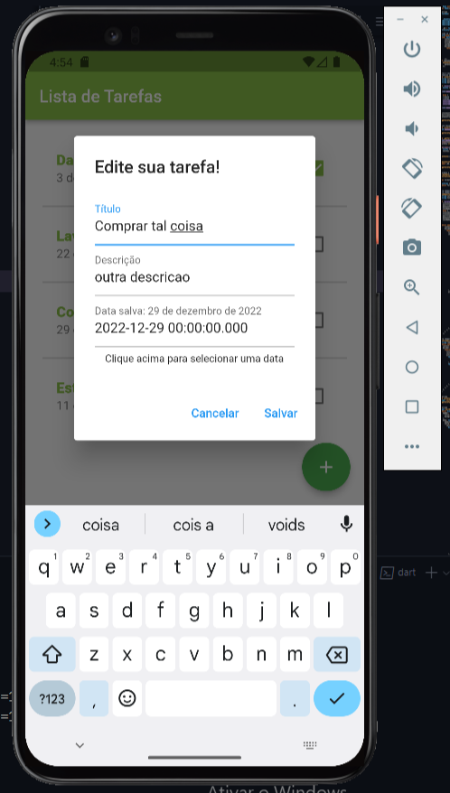

  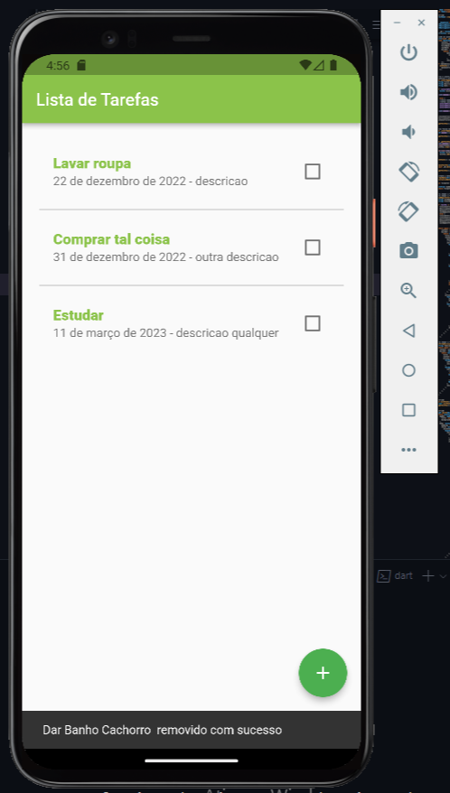
  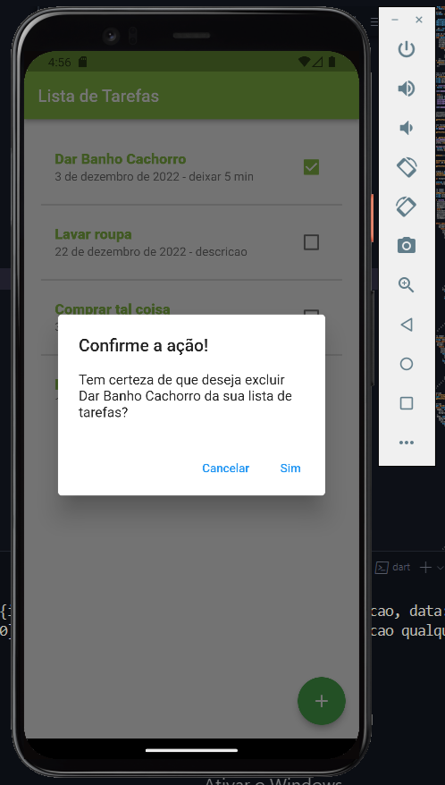

